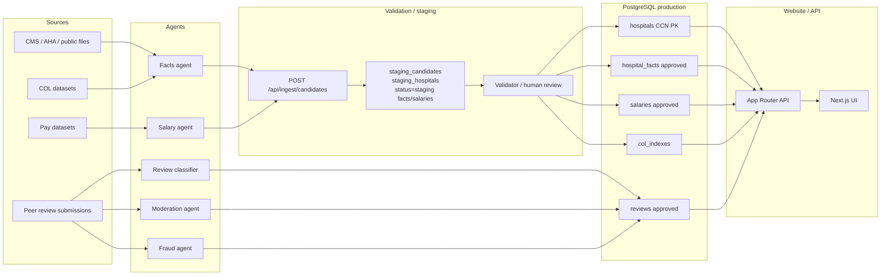

# Hospital Compare

Workplace comparison for U.S. travel and staff nurses. Compare hospitals on **pay**, **work-environment proxies** (trauma, Magnet, teaching, ownership, beds, EMR), **cost of living**, and **peer reviews**.

This repository is a working MVP of the **data plane**, not a live CMS scrape. Seed hospitals use placeholder CCNs (`SAMPLE-001` … `SAMPLE-006`) and labeled sample pay/COL datasets. Agents never write live UI content.

## Stack

- **Next.js 16** App Router, TypeScript, Tailwind CSS v4, shadcn/ui
- **PostgreSQL 16** with **Prisma 7** (migrations + seed)
- Typed API contracts in `src/lib/contracts.ts` (Zod)
- Docker Compose runs Postgres + the app on port **43180**

## Architecture

AI/agents propose candidate records. A validation step is the only path into production tables. The website and public API read approved rows only.



Primary hospital identifier is **CMS CCN** (`hospitals.ccn`, string). Name variants are not keys.

## Run locally

### Option A — Docker Compose (preferred)

```bash
cp .env.example .env
docker compose up --build
```

App: http://localhost:43180  
Postgres: `localhost:5432` (user/password/db `hospital` / `hospital` / `hospital_compare`)

On startup the app container runs `prisma migrate deploy` and `prisma db seed`.

### Option B — App on the host, Postgres in Docker

```bash
cp .env.example .env
docker compose up -d postgres
npm install
npx prisma migrate deploy
npx prisma db seed
npm run dev
```

### Option C — Local PostgreSQL (no Docker)

```bash
sudo -u postgres createuser hospital
sudo -u postgres createdb -O hospital hospital_compare
sudo -u postgres psql -c "ALTER USER hospital WITH PASSWORD 'hospital';"
cp .env.example .env
npm install
npx prisma migrate deploy
npx prisma db seed
npm run dev
```

## Environment variables

| Name | Purpose |
| --- | --- |
| `DATABASE_URL` | Prisma connection string |
| `INGEST_API_KEY` | Shared secret for `POST /api/ingest/candidates` |
| `NEXT_PUBLIC_APP_URL` | Documented public origin (optional at runtime) |

## Local pay benchmark import

`scripts/import-local-pay-benchmarks.ts` loads **normalized** local profession pay benchmarks into `local_pay_benchmarks`. It does not download government files. Dry-run is the default; `--write` upserts only when every row is valid. Any validation failure blocks the whole file, same as the CMS importers.

```bash
npx tsx scripts/import-local-pay-benchmarks.ts --file data/fixtures/local-pay-benchmarks.sample.csv
npx tsx scripts/import-local-pay-benchmarks.ts --file path/to/normalized.csv --write
```

Required CSV header (order does not matter):

`professionSlug`, `geographicAreaCode`, `geographicAreaName`, `geographicLevel`, `hourlyMean`, `hourlyMedian`, `annualMean`, `annualMedian`, `source`, `sourceDataset`, `sourceUrl`, `effectiveDate`

`professionSlug` must match an active profession already stored by `scripts/initialize-workplace-catalog.ts`. Do not include a profession id column. Empty wage cells are null; at least one wage is required. `data/fixtures/local-pay-benchmarks.sample.csv` is a fake fixture for the format, not a wage dataset.

## API

All public reads use **approved** production rows. Staging candidates are invisible here.

| Method | Path | Notes |
| --- | --- | --- |
| `GET` | `/api/hospitals?search=` | Directory search (name, city, state, ZIP, CCN) |
| `GET` | `/api/hospitals/:ccn` | Hospital, approved facts/salaries, COL, review aggregates |
| `POST` | `/api/compare` | `{ "ccns": ["SAMPLE-001","SAMPLE-002"], "role": "Travel RN" }` |
| `POST` | `/api/reviews` | Submit review → `moderation_status=pending` |
| `GET` | `/api/hospitals/:ccn/reviews` | Approved reviews only |
| `POST` | `/api/ingest/candidates` | Agent ingest; `Authorization: Bearer $INGEST_API_KEY` |

COL-adjusted hourly = mid-point hourly ÷ (COL index / 100). Index 100 is the seed national baseline. Adjustment is omitted unless both an approved salary and a COL row exist.

### Grok / agent ingest

```bash
curl -sS -X POST "$NEXT_PUBLIC_APP_URL/api/ingest/candidates" \
  -H "Content-Type: application/json" \
  -H "Authorization: Bearer $INGEST_API_KEY" \
  -d '{
    "sourceAgent": "grok-hospital-facts-v1",
    "candidates": [
      {
        "type": "fact",
        "hospitalCcn": "SAMPLE-001",
        "fieldName": "beds",
        "value": "420",
        "source": "Unvalidated agent candidate",
        "sourceUrl": "https://example.invalid/source",
        "effectiveDate": "2026-03-01",
        "confidence": 0.4
      },
      {
        "type": "salary",
        "hospitalCcn": "SAMPLE-003",
        "role": "Travel RN",
        "hourlyMin": 51,
        "hourlyMax": 67,
        "source": "Unvalidated agent candidate",
        "effectiveDate": "2026-03-01",
        "confidence": 0.35
      },
      {
        "type": "hospital",
        "ccn": "SAMPLE-099",
        "source": "Unvalidated agent candidate",
        "payload": { "name": "Proposed Sample Hospital", "city": "Topeka", "state": "KS" }
      }
    ]
  }'
```

Accepted rows are stored as `status=staging` (or in `staging_hospitals` for new CCNs). They do **not** appear in search, compare, or hospital pages until a validator sets `approved`.

Review POST is a public submit endpoint. Hooks for later workers are documented in `src/lib/queries.ts` (`submitReview`): Review Classifier, Moderation, and Fraud agents.

## Schema (Prisma)

See `prisma/schema.prisma`. Core tables:

- `hospitals` — CCN primary key
- `hospital_facts` — sourced field values + `status`
- `salaries` — pay bands + `status`
- `col_indexes` — ZIP or metro key
- `reviews` — immutable `body`, scores, `moderation_status`
- `review_flags`
- `staging_candidates`, `staging_hospitals`

## UI

- `/` product home
- `/hospitals` search and multi-select
- `/compare?ccns=SAMPLE-001,SAMPLE-002` table
- `/hospitals/[ccn]` detail, approved reviews, pending submit form

Every page carries a **data under construction / validation pipeline** banner.
